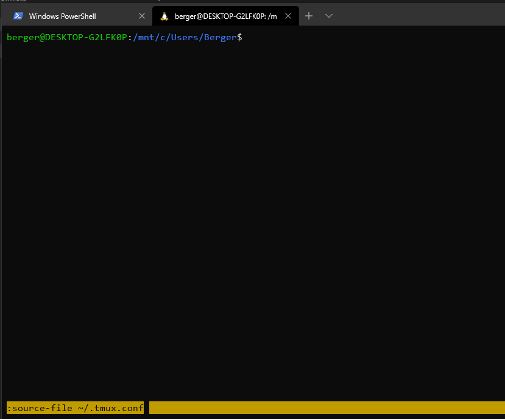
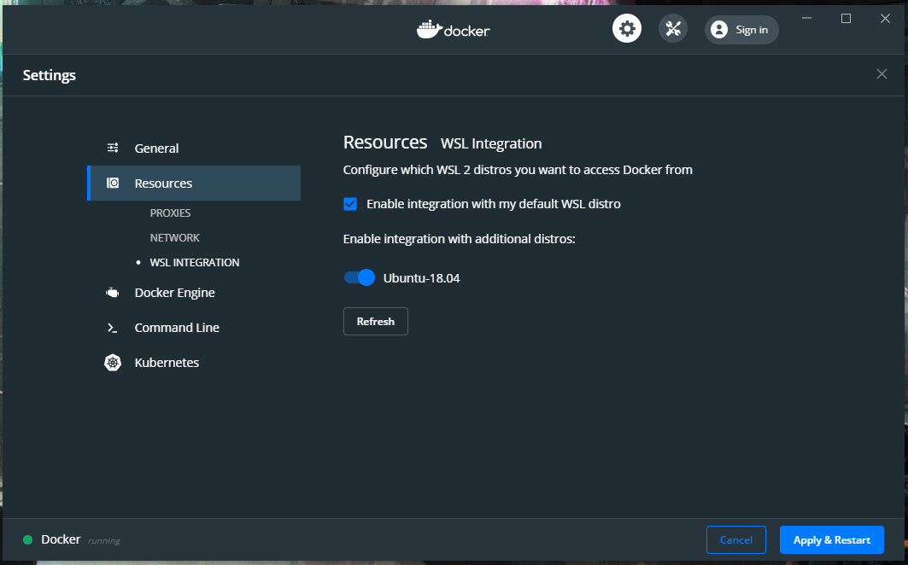

# Windows 10 Configuration

## Requirements

- Enabled CPU Virtualization in BIOS

## Scoop - Windows CLI Installer

Scoop site: <https://scoop.sh/>
Open powershell as administrator and run below commands

```powershell
Set-ExecutionPolicy RemoteSigned -scope CurrentUser

iwr -useb get.scoop.sh | iex
```

Add some extra buckets

```powershell
scoop install git
scoop bucket add extras
scoop bucket add versions
```

## Windows Tabbed Terminal

<https://github.com/microsoft/terminal>


## WSL2

At this point to take benefits from WSL2 we have join to Windows Insider Program

### Installation

https://docs.microsoft.com/en-us/windows/wsl/wsl2-install

### Vscode integration

Step by step tutorial: https://code.visualstudio.com/remote-tutorials/wsl/getting-started

- Inside Vscode on Windows install extension: <https://marketplace.visualstudio.com/items?itemName=ms-vscode-remote.remote-wsl>
- On WSL Linux run `code .` inside project directory. That command will trigger vscode server installation for our WSL

### WSL - Ubuntu Configuration

#### ZSH

**Install**

`sudo apt-get install zsh`

**Set as default shell**

`chsh -s $(which zsh)`

**Install Oh my ZSH**
<https://github.com/ohmyzsh/ohmyzsh>

`sh -c "$(curl -fsSL https://raw.githubusercontent.com/ohmyzsh/ohmyzsh/master/tools/install.sh)"`

**Install Spaceship for ZSH**
<https://github.com/denysdovhan/spaceship-prompt>

**Plugins**

```bash
# https://github.com/zsh-users/zsh-autosuggestions/blob/master/INSTALL.md
git clone https://github.com/zsh-users/zsh-autosuggestions ${ZSH_CUSTOM:-~/.oh-my-zsh/custom}/plugins/zsh-autosuggestions

# https://github.com/zsh-users/zsh-completions
git clone https://github.com/zsh-users/zsh-completions ${ZSH_CUSTOM:=~/.oh-my-zsh/custom}/plugins/zsh-completions

# https://github.com/olivierverdier/zsh-git-prompt - manual installation

```

#### Vim example configuration

```bash
cat <<EOF > ~/.vimrc
set t_Co=256
syntax enable
set background=dark

set number
set showbreak=+++
set showmatch
set visualbell

set hlsearch
set smartcase
set ignorecase
set incsearch

set autoindent
set shiftwidth=4
set smartindent
set smarttab
set softtabstop=4

set ruler

set undolevels=1000
set backspace=indent,eol,start

EOF
```

#### Tmux example configuration

- paste and overwrite configuration

```bash
cat <<EOF > ~/.tmux.conf
# remap prefix from 'C-b' to 'C-a'
unbind C-b
set-option -g prefix C-a
bind-key C-a send-prefix

# Start window numbering at 1
set -g base-index 1
setw -g pane-base-index 1
set -g renumber-windows on
set -g history-limit 10000

set -g status-keys vi
setw -g mode-keys vi

set -g default-terminal "screen-256color"

bind -r M-h resize-pane -L 5
bind -r M-j resize-pane -D 5
bind -r M-k resize-pane -U 5
bind -r M-l resize-pane -R 5

# Pane splitting.
bind | split-window -h -c "#{pane_current_path}"
bind - split-window -v -c "#{pane_current_path}"


bind -r < swap-window -t -1
bind -r > swap-window -t +1

bind R source-file ~/.tmux.conf

# Make mouse useful in copy mode
set-option -g mouse on
# Lower escape timing from 500ms to 50ms for quicker response to scroll-buffer access.
set -s escape-time 50

# bind-key c new-window -n '*'
# don't rename windows automatically
set-option -g allow-rename off

bind -n WheelUpPane if-shell -F -t = "#{mouse_any_flag}" "send-keys -M; send-keys -M; send-keys -M; send-keys -M" "if -Ft= '#{pane_in_mode}' 'send-keys -M; send-keys -M; send-keys -M; send-keys -M' 'copy-mode -e; send-keys -M; send-keys -M'"
bind -n WheelDownPane if-shell -F -t = "#{mouse_any_flag}" "send-keys -M; send-keys -M; send-keys -M; send-keys -M" "if
-Ft= '#{pane_in_mode}' 'send-keys -M; send-keys -M; send-keys -M; send-keys -M' 'copy-mode -e; send-keys -M; send-keys -M'"
#bind-key -t vi-copy y copy-pipe -x "xsel -i -p -b"
# bind-key -T copy-mode-vi C-c send-keys -X copy-pipe "xclip -selection clipboard ; tmux send-keys -X clear-selection"
# unbind -T copy-mode-vi MouseDragEnd1Pane
bind -n M-w run -b "tmux show-buffer | clip.exe"

EOF
```

- run tmux `tmux`. In some cases new configuration doesn't work so source configuration file manually with `CTRL + b` and type `:source-file ~/.tmux.conf`


- How to copy between WSL Tmux and Windows
<https://superuser.com/questions/1493942/copy-text-from-wsl-to-windows-clipboard>

```
With this key configuration, you can select text with the mouse and copy it(to the tmux buffer) using Alt+w. (If you want to select something and don't want it to disappear, press shift while letting the mouse button go.) After this, press Alt+w again in order to copy the tmux buffer to the Windows clipboard.
```

## Docker

### Based on WSL2

#### Requirements

- Make sure your Linux subsystem use WSL Version 2
    Check version with command `wsl -v -l`
    ```
      NAME                   STATE           VERSION
    * Ubuntu-18.04           Running          1
    ```
    
    Convert to WSL2 with `wsl --set-version Ubuntu-18.04 2`

#### Installation

Use step by step below instructions:
https://docs.docker.com/docker-for-windows/wsl-tech-preview/

Add Linux user to docker group:

```bash
sudo usermod -aG docker $USER
```

#### Choose selected WSL



## Extras

### Suggested git configuration

This configuration is suggested both for Windows git and WSL git to provide correct line endings used in most  cases

```bash
git config --global core.autocrlf false
```
